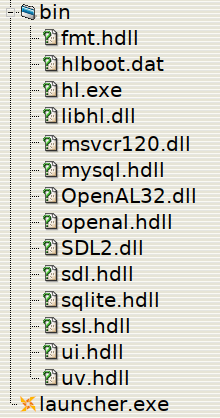

Hashlink launcher
=================

Hashlink launcher helps you to launch applications stored in
[Hashlink](https://hashlink.haxe.org/) bytecode.  The goal is to avoid the
hassle of native compilation of Haxe via C, and at the same time allow to
provide your end users with an application they can launch with an `.exe` file.

Since Hashlink bytecode is portable you can compile your bytecode and prepare a
distribution archive on a non-Windows platform.

Preparing a distribution package
================================

To prepare a distribution package you will need:

  * **Hashlink launcher executable**: the latest version of `launcher.exe` can
    be found in the [releases](https://github.com/jstolarek/hashlink-launcher/releases)
    section.
  * **Hashlink binaries**: these can be obtained from [Hashlink release
    page](https://github.com/HaxeFoundation/hashlink/releases).  Download a
    release version that matches the version you used to compile your bytecode.
  * **application bytecode**: compile your bytecode to `hlboot.dat` file using
    `-hl hlboot.dat` compilation flag.

Create a distribution directory and place the files in a following layout:

  * place `launcher.exe` inside the distribution directory.  Feel free to rename
    `launcher.exe` to anything that makes more sense your end users, like
    `game.exe`.

  * inside the distribution directory create a `bin` subdirectory that contains
    the following files obtained from Hashlink binaries:
    - Hashlink VM executable `hl.exe`
    - all `.hdll` files.  At the moment of this writing these are: `fmt.hdll`,
      `mysql.hdll`, `sdl.hdll`, `sqlite.hdll`, `ssl.hdll`, `ui.hdll`, and
      `uv.hdll`
    - all `.dll` files.  At the moment of this writing these are: `libhl.dll`,
      `msvcr120.dll`, `OpenAL32.dll`, and `SDL2.dll`

  * place your bytecode file `hlboot.dat` inside the `bin` subdirectory.

  * if your application requires any sort of assets place those in the `bin/`
    subdirectory.  Of course if the application expects them to be in a
    sub-folder, say `res/`, then you need to place that folder in `bin/`.  Just
    think of `bin/` as an application root from the perspective of application
    that you've written.

  * remember to put any documentation and license files into the distribution
    directory.  These can go at the top-level or in a dedicated directory -
    documentation does not need to be in `bin/`.

Therefore, the distribution directory should contain at least the following
files:

Put the prepared directory into an archive (ZIP is probably the most accessible
on Windows) and distribute it to your users.

Compiling
=========

Hashlink launcher is written in C#.  Compilation under Linux requires Mono.
Once you have Mono installed on your system run `make`.  This will produce
`launcher.exe` in the `bin/` directory.  Note that a file compiled in this way
will be unsigned and might result in Windows Defender warnings when launching.

I have no idea how to compile this on Windows :-)

Motivation
==========

I use Haxe and the [heaps.io](https://heaps.io/) engine to create games during
game jams.  Linux is my platform of choice and, although Haxe is fully portable,
creating a distribution package for Windows users turned out to be a bit of a
problem.  Putting all the required files together is not an issue, but I still
needed a way to execute `hl.exe hlboot.dat` to actually launch the game.  At
first I went with the simplest option and created a simple `.bat` file launcher
but I noticed that people were getting confused (weird unknown extension, no
icon).  So I created this trivial application instead.  Thanks to it I can
create a lightweight Windows distribution package without having to actually
deal with Windows.
